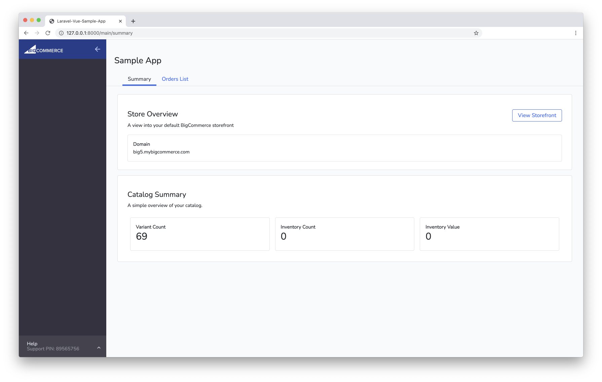

# Laravel Vue Sample App for BigCommerce



## Installation

Before jumping in, you'll want to make sure you have the system requirements met:

### 1. Setup Environment

 - PHP ([Installation Guide](https://www.php.net/manual/en/install.php))

- Composer ([Installation Guide](https://getcomposer.org/doc/00-intro.md))

- Laravel ([Installation Guide](https://laravel.com/docs/8.x))

- Local SSL Cert (Recommend Valet or Homestead to ease set up)

- Mac OS: Valet ([Installation Guide](https://laravel.com/docs/8.x/valet))
- Windows / Linux: Homestead ([Installation Guide](https://laravel.com/docs/8.x/homestead))

### 2. Install PHP dependencies

   ```bash
   composer install
   ```

### 3. Install JS dependencies

   ```bash
   npm install
   ```

### 4. Copy sample .env

   ```bash
   cp .env.example .env
   ```

To test on a BigCommerce store, you can create a free trial on bigcommerce.com or request a free sandbox store by [signing up to be a tech partner](https://www.bigcommerce.com/partners/).

## Usage

- To compile JS assets:

   ```bash
   npm run dev or npm run watch
   ```

   After compiling the app:
   - Simply run the app locally using below command and url.
     ```bash
     php artisan serve
     ```
       [http://localhost:8000](http://localhost:8000) or [http://127.0.0.1:8000](http://127.0.0.1:8000)
   - If using Valet it should be reachable at the site you are hosting the app on locally. i.e [https://laravel-vue-sample-app.test](https://laravel-vue-sample-app.test)

- When running the app outside of BigCommerce, setting the follow environment variable will cause the app to use the local API credential (also in the .env file):
`APP_ENV=local`

- Likewise, setting it to production will use only the credentials received during the OAuth handshake when the app is install on the BigCommerce store:
`APP_ENV=production`

- To show a sidebar that emulates the BigCommerce admin, set the following env variable:
`MIX_APP_INSTALL=local`

- And to hide that sidebar:
`MIX_APP_INSTALL=production`

## Configuring App for Installation on a BigCommerce Store

- (*Recommended if not using secured Valet site*) In a new terminal tab run an instance of ngrok (http://ngrok.io/) that points to your local site and copy the https ngrok url
- Set `APP_ENV` .env value to `production`
- Set `BC_APP_CLIENT_ID` and `BC_APP_SECRET` .env values to ones for a draft BigCommerce app you create at https://devtools.bigcommerce.com with the following technical details:
  - Supports multiple users
  - Is a single-click app
  - For the Auth Callback URL use: `{https ngrok url}/oauth/install` or `{your local https url for the app}/oauth/install`
  - For the Load Callback URL use: `{https ngrok url}/oauth/load` or `{your local https url for the app}/oauth/load`
  - For the scopes, select: Orders (Modify), Products (Read-only), Information & Settings (Read-only)
- Set `APP_URL` .env value to what you used for the Auth Callback URL above

Now when you go to *Apps -> My Apps -> My Draft Apps* section of your BigCommerce store admin you should see your app! It can be installed onto your store from there.

## Using BigDesign React Components

This app can use the React [BigDesign](https://bigcommerce.github.io/big-design) Components or Custom React Components.

### 1. Global Usage


- Register react components in reactComponents.js(`./resources/js/reactComponents.js`) file

   ```bash
   import { Button } from "@bigcommerce/big-design";
   export default { ..., Button, };
   ```

- Use the registered react components in Vue Component

   ```bash
   <template>
       ...
           <BigButton variant="secondary" @onClick="handleClickViewStore"/>
       ...
   </template>
   ```

 **_Important:_** Needed to add the `Big` prefix, when use the registered react components. EX: `BigButton`

### 2. Or Local Usage

- Create react component(function or class) file with the name `example.react.jsx`

**_Important:_** Needed to add the suffix `react` to file or folder name.
EX: `columns.react.jsx` or `MainOrderActionModal.react`

- Wrap the react component with `ReactInVue` function of [vuera](https://github.com/akxcv/vuera/) npm library.
   ```bash
   <script>
   import { AlertsManager } from "@bigcommerce/big-design";
   import { ReactInVue } from "vuera";

   export default {
       ...
       components: {
           "alerts-manager": ReactInVue(AlertsManager)
       },
      ...
   };
   </script>

## Contributing

Pull requests are welcome. For major changes, please open an issue first to discuss what you would like to change.

## License

MIT
